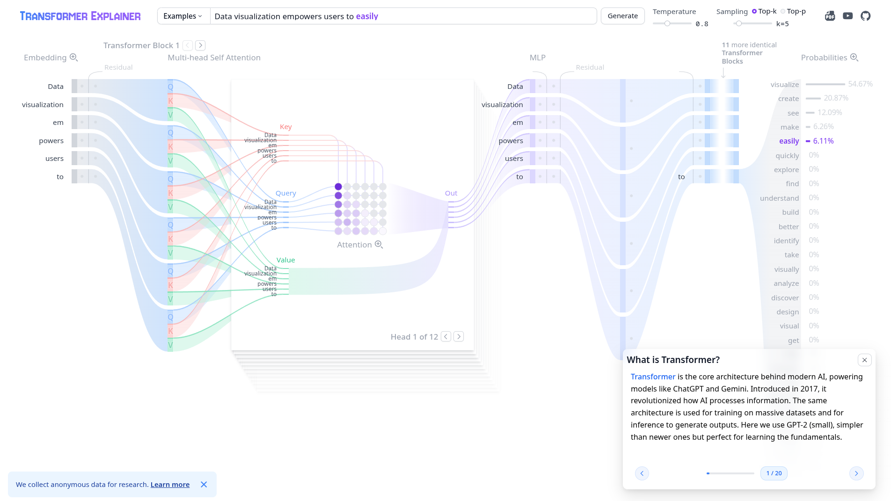

# 🎨 Awesome Visual ML — Your Interactive Machine Learning Gallery

> **Where Complex Concepts Become Crystal Clear**

Welcome to the most comprehensive curated gallery of **interactive Machine Learning visualizations** on the web! This isn't just another list of links — it's your personal gateway to understanding ML through intuition, interactivity, and stunning visuals.

Perfect for:
- 🧠 **Visual learners** who grasp concepts better through diagrams than equations
- 🎯 **Beginners** seeking intuitive understanding before diving into complex math
- 🚀 **Educators** looking for engaging teaching resources
- 🔍 **Curious minds** wanting to explore ML concepts hands-on

---

## 📚 What's Inside?

Each entry in this gallery features:
- 🖼️ **Live preview** - See the interface before you click
- 🔗 **Direct link** - Jump straight to the interactive experience  
- 📝 **Rich description** - Understand what you'll learn and why it matters
- 🏷️ **Smart categorization** - Find exactly what you need, fast

**Pro tip:** Clone this repo and browse the screenshots alongside the links. You'll quickly spot which tools match your learning style!

---

## 🗺️ Quick Navigation

- [🧠 Neural Nets & Deep Learning](#-neural-nets--deep-learning)
- [🤖 Transformers & NLP](#-transformers--nlp)
- [🔍 Model Debugging & What-If](#-model-debugging--what-if)
- [🎨 Classics & Multi-Topic Visualizations](#-classics--multi-topic-visualizations)
- [📊 Math, Stats & Probability](#-math-stats--probability)
- [📚 Guides, Courses & Blogs](#-guides-courses--blogs)

---

## 🧠 Neural Nets & Deep Learning

### Keras-JS Demos

**🔗 [Explore Keras-JS](https://transcranial.github.io/keras-js-demos/)**

**Why you'll love it:** Experience the magic of deep learning right in your browser! Watch pre-trained neural networks recognize digits, detect emotions, and classify images in real-time using WebGL acceleration. It's ML inference made visible and interactive.

---

### ConvNetJS (Andrej Karpathy)

**🔗 [Explore ConvNetJS](https://cs.stanford.edu/people/karpathy/convnetjs/)**

**Why you'll love it:** Go beyond theory and build neural networks with your own hands! This legendary JavaScript library lets you experiment with CNNs, RNNs, and even reinforcement learning agents. Watch training unfold layer by layer, epoch by epoch.

---

### CNN Explainer (Polo Club)

**🔗 [Explore CNN Explainer](https://poloclub.github.io/cnn-explainer/)**

**Why you'll love it:** Ever wondered what happens inside a convolutional neural network? This stunning visualizer peels back the layers to show you filters, feature maps, and pooling in action. It's like having X-ray vision for CNNs!

---

### GAN Lab (Polo Club)

**🔗 [Explore GAN Lab](https://poloclub.github.io/ganlab/)**

**Why you'll love it:** Watch the fascinating dance of Generative Adversarial Networks! See generators and discriminators compete in real-time, experiment with mode collapse, and understand why GANs are both powerful and tricky to train.

---

### TensorFlow Playground

**🔗 [Explore TensorFlow Playground](https://playground.tensorflow.org/)**

**Why you'll love it:** The ultimate sandbox for neural network intuition! Tweak every parameter imaginable — layers, activations, learning rates — and watch decision boundaries form before your eyes. Perfect for understanding hyperparameter impact.

---

## 🤖 Transformers & NLP

### Transformer Explainer (Polo Club)

**🔗 [Explore Transformer Explainer](https://poloclub.github.io/transformer-explainer/)**

**Why you'll love it:** Demystify the architecture behind ChatGPT and modern AI! This interactive visualization makes self-attention, multi-head attention, and token relationships crystal clear. Finally understand what makes transformers so revolutionary.

---

### The Illustrated BERT (Jay Alammar)

**🔗 [Explore Illustrated BERT](https://jalammar.github.io/illustrated-bert/)**

**Why you'll love it:** A masterpiece of technical communication! Jay Alammar's beautiful guide walks you through BERT's inner workings with elegant diagrams and animations. You'll emerge with a deep, intuitive understanding of transformer models.

---

## 🔍 Model Debugging & What-If

### What-If Tool (PAIR)

**🔗 [Explore What-If Tool](https://pair-code.github.io/what-if-tool/)**

**Why you'll love it:** Become an ML detective! This powerful tool lets you interrogate models without writing code. Test counterfactuals, analyze fairness, slice datasets, and uncover hidden biases. Essential for responsible AI development.

---

### Embedding Projector (TensorFlow)

**🔗 [Explore Embedding Projector](https://projector.tensorflow.org/)**

**Why you'll love it:** Step into the hidden world of word and data embeddings! Visualize high-dimensional data in 2D/3D using PCA, t-SNE, and UMAP. Discover clusters, relationships, and patterns you never knew existed.

---

## 🎨 Classics & Multi-Topic Visualizations

### R2D3 — A Visual Introduction to ML

**🔗 [Explore R2D3](https://www.r2d3.us/visual-intro-to-machine-learning-part-1/)**

**Why you'll love it:** Experience ML through the art of visual storytelling! This scroll-based masterpiece introduces decision trees and feature importance with breathtaking animations. It's how ML education should always be.

---

### Setosa

**🔗 [Explore Setosa](https://setosa.io/)**

**Why you'll love it:** A treasure trove of interactive math and data visualizations! From PCA to gradients to filters, each concept comes alive through elegant, intuitive animations. Perfect for building foundational intuition.

---

### Seeing Theory (Brown University)

**🔗 [Explore Seeing Theory](https://seeing-theory.brown.edu/)**

**Why you'll love it:** The missing link between statistics and intuition! Brown University's interactive introduction makes probability and statistics accessible, engaging, and dare we say... fun? Essential foundation for any ML journey.

---

### MLU-Explain

**🔗 [Explore MLU-Explain](https://mlu-explain.github.io/)**

**Why you'll love it:** Cut through the complexity with clean, focused visual explainers! From kernels to regularization to bias-variance tradeoff, each concept is distilled to its essence. Perfect for quick, deep understanding.

---

### ML Visualized

**🔗 [Explore ML Visualized](https://ml-visualized.com/)**

**Why you'll love it:** Learn ML through the language of visuals! This site prioritizes diagrams and animations over dense formulas, making complex concepts feel natural and intuitive. Visual learning at its finest.

---

### KDE Explorer

**🔗 [Explore KDE Explorer](https://mathigon.org/course/statistics/kde)**

**Why you'll love it:** Master the art and science of Kernel Density Estimation! This interactive tool shows you how bandwidth choices shape your data visualization and why KDE is so powerful for understanding distributions.

---

### K-Means Interactive

**🔗 [Explore K-Means](https://www.naftaliharris.com/blog/visualizing-k-means-clustering/)**

**Why you'll love it:** Take control of the clustering process! Place points manually, adjust cluster counts, and watch k-means algorithms converge step by step. You'll never see clustering the same way again.

---

### Dimensionality Reduction Playground

**🔗 [Explore Dimensionality Reduction](https://pair-code.github.io/understanding-umap/)**

**Why you'll love it:** Witness the magic of dimensionality reduction! Compare PCA, t-SNE, and UMAP side by side as they transform high-dimensional data into beautiful 2D visualizations. Understand the trade-offs and strengths of each method.

---

## 📊 Math, Stats & Probability

### Statistics by Jim

**🔗 [Explore Statistics by Jim](https://statisticsbyjim.com/)**

**Why you'll love it:** Statistics made practical and visual! Jim's blog-style tutorials combine real-world examples with clear visuals, making hypothesis testing, regression, and distributions feel approachable and applicable.

---

### BioStatSquid

**🔗 [Explore BioStatSquid](https://biostatsquid.com/)**

**Why you'll love it:** Where biostatistics meets clarity! These accessible explanations connect statistical concepts to real biomedical data, making it perfect for ML learners interested in healthcare and life sciences applications.

---

## 📚 Guides, Courses & Blogs

### PAIR (Google)

**🔗 [Explore PAIR](https://pair.withgoogle.com/)**

**Why you'll love it:** Think beyond algorithms! Google's PAIR team explores the human side of AI — design principles, ethical considerations, and case studies that remind us ML is about people, not just math.

---

### Simon Ward-Jones

**🔗 [Explore Simon Ward-Jones](https://simonwardjones.com/)**

**Why you'll love it:** Fresh perspectives on ML and AI! Simon's blog combines approachable visuals with practical tutorials, covering everything from cutting-edge research to hands-on implementation tips.

---

### ML Addict

**🔗 [Explore ML Addict](https://mladdict.com/)**

**Why you'll love it:** Feed your ML curiosity with diverse content! From concept explainers to practical tutorials, this site offers a smorgasbord of ML knowledge served with helpful diagrams and examples.

---

### Numiqo

**🔗 [Explore Numiqo](https://numiqo.com/)**

**Why you'll love it:** Your friendly guide to ML concepts! Numiqo's beginner-friendly approach combines step-by-step instructions with clear graphics, making even complex topics feel manageable and fun.

---

### Dive into Deep Learning (D2L)

**🔗 [Explore D2L](https://d2l.ai/)**

**Why you'll love it:** The complete interactive deep learning book! D2L seamlessly blends mathematical rigor, practical code, and intuitive illustrations. From linear regression to transformers, it's your comprehensive guide to modern deep learning.

---

## 🤝 Contributing

**Want to add a gem to this collection?** We'd love your help!

**Contributions should include:**
- 📝 **Title** - Clear, descriptive name
- 🔗 **Link** - Direct URL to the interactive visualization
- 📄 **Description** - 1-2 sentences explaining what makes it special
- 🖼️ **Preview image** - Screenshot in `/img` (PNG/JPG, ~300 KB)

**What makes a good addition?**
- ✨ Interactive, not just static content
- 🎨 Strong visual/interactive elements
- 📚 Educational value for ML concepts
- 🌐 Free and accessible

---

## 📄 License

This curated collection is released under the **MIT License**. 

**Important:** All linked websites retain their original copyrights and licenses. This repository simply organizes and presents these amazing resources for educational purposes.

---

## 🎉 Start Your Visual Learning Journey!

You're now equipped with the ultimate collection of interactive ML visualizations. Whether you're just starting out or looking to deepen your understanding, these tools will transform abstract concepts into tangible intuition.

**Happy exploring!** 🚀🤖🎨

---

*Made with ❤️ for the visual learning community*
